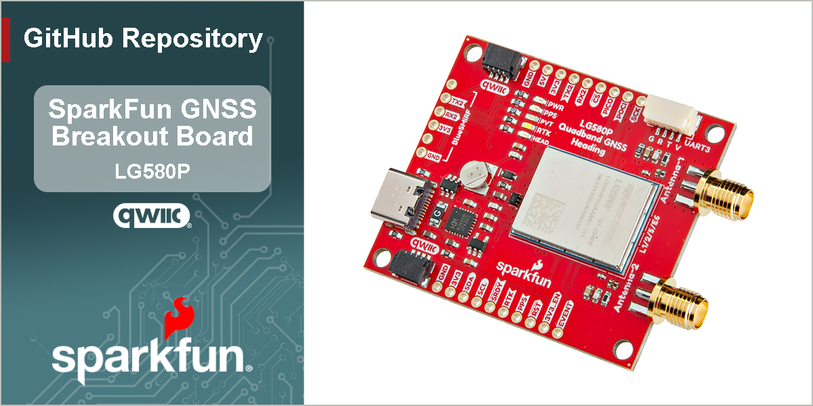

SparkFun Quadband GNSS RTK with Heading Breakout - LG580P (Qwiic)
========================================

[*SparkFun Quadband GNSS RTK with Heading Breakout - LG580P (Qwiic) (GPS-28019)*](https://www.sparkfun.com/sparkfun-quadband-gnss-rtk-with-heading-breakout-lg580p-qwiic.html)

The [SparkFun Quadband GNSS RTK with Heading Breakout - LG580P (Qwiic)](https://www.sparkfun.com/sparkfun-quadband-gnss-rtk-with-heading-breakout-lg580p-qwiic.html) features the Quectel LG580P GNSS module, providing exceptional positioning and heading accuracy. The LG580P GNSS module is an upgraded version of the LG290P on our [SparkFun Quadband GNSS RTK Breakout - LG290P (Qwiic)](https://www.sparkfun.com/sparkfun-quadband-gnss-rtk-breakout-lg290p-qwiic.html); providing an additional GNSS antenna input for instantaneous heading determination down to 0.1&deg;. In traditional navigation systems, such as those used on your phone or car, previous navigation points are utilized to determine the course heading. This is the reason why the arrow indicator will spin or be oriented in the wrong directions when the navigation system first boots or has been stationary for extended periods of time. However, with the LG580 GNSS module, users are provided with a dedicated heading without relying on previous course data points, magnetometers/compasses, or gyroscopes in IMUs, which can introduce small errors.

The board's dimensions, pin layout, and connectors are similar to our very popular [SparkFun GPS-RTK-SMA Breakout - ZED-F9P (Qwiic)](https://www.sparkfun.com/sparkfun-gps-rtk-sma-breakout-zed-f9p-qwiic.html), featuring a compact design and convenient Qwiic connectors. *(\*Depending on your application, this board could potentially function as a drop-in replacement; users should verify the pin compatibility of this board with their current installation.)* The board also accommodates users with a diverse choice of interfaces including UART, SPI*, I2C*, and CAN*. The board has three UART ports, which are accessible through the USB-C connector, BlueSMiRF *(6-pin PTH)* header, and 4-pin locking JST connector. Users can also interface with the board through the 25 PTH pins that are broken out around the edge of the board. For the GNSS antenna(s), SMA antenna connectors are provided on the edge of the board; an optional, secondary antenna can be utilized for heading determination. We also provide two 4-pin JST Qwiic connectors for future use, when the I2C feature becomes available for the GNSS module.

The LG580P module is a quad-band, multi-constellation, high-precision, RTK and heading GNSS receiver. The module is capable of simultaneously receiving signals from the `L1`, `L2`, `L5`, and `L6`/`E6` frequency bands of the GPS, GLONASS, Galileo, BDS, QZSS, and NavIC GNSS constellations. In addition, the module supports SBAS augmentation systems (WAAS, EGNOS, BDSBAS, MSAS, GAGAN, KASS, ASECNA, SouthPAN, and SDCM), PPP services* (BDS PPP-B2b, QZSS CLAS, MADOCA-PPP, and Galileo HAS), RTCM, and RTK corrections for precision navigation with a fast convergence time and reliable performance.

The built-in professional-grade interference signal detection and elimination algorithms, effectively mitigate multiple narrow-band interference sources and significantly improve signal reception performance in complex electromagnetic environments. In addition, the RTK and heading algorithms ensure reliable positioning in challenging scenarios such as urban environments and deep tree cover. With its high-precision, low power consumption and a high positioning and heading update rate of up to 20 Hz, this board is ideal for high-precision navigation applications, such as intelligent robots, precision agriculture, ADAS, and autonomous driving.

> [!NOTE]
> `*`: Feature is still under development

> [!IMPORTANT]
> - Currently, only the UART interface is supported by the module. All three UART ports are broken out to the USB-C connector *(via CH342 USB-serial converter)*, 4-pin locking JST connector, and BlueSMiRF 6-pin header.
> - Additionally, the corrections for some of the PPP services may not be implemented yet.

Documentation
--------------

- **[Hookup Guide (mkdocs)](http://docs.sparkfun.com/SparkFun_GNSS_LG580P/)** - A hookup guide for the SparkFun Quadband GNSS RTK Breakout - LG580P breakout board hosted by GitHub pages 
   
- [SparkFun LG290P GNSS Arduino Library](https://github.com/sparkfun/SparkFun_LG290P_GNSS_Arduino_Library) - An Arduino library for the LG290P and LGx80P GNSS modules

Repository Contents
-------------------

- **[/docs](/docs/)** - Online documentation files
  - [/assets](/docs/assets/) - Assets files
    - [/3d_model](/docs/assets/3d_model/) - 3D models for the board
    - [/board_files](/docs/assets/board_files/) - Design files for the board
      - [KiCad Design Files](/docs/assets/board_files/kicad_files.zip) (.zip)
      - [Schematic](/docs/assets/board_files/schematic.pdf) (.pdf)
      - [Dimensions](/docs/assets/board_files/dimensions.pdf) (.pdf)
    - [/component_documentation](/docs/assets/component_documentation/) - Datasheets for hardware components
    - [/img/hookup_guide](/docs/assets/img/hookup_guide/) - Images for hookup guide documentation - Hookup guide images for the board
    - /Hardware - Hardware design files (.brd, .sch)
      - /Production - Production files

Product Variants
----------------

- [GPS-28019](https://www.sparkfun.com/sparkfun-quadband-gnss-rtk-with-heading-breakout-lg580p-qwiic.html) - v1.0, Initial Release
- LG290P Variants
  - [GPS-26620](https://www.sparkfun.com/sparkfun-quadband-gnss-rtk-breakout-lg290p-qwiic.html) - SparkFun LG290P Breakout
  - [GPS-26916](https://www.sparkfun.com/sparkfun-rtk-postcard.html) - SparkFun RTK Postcard *(LG290P + ESP32)*

Version History
---------------

- [v10](https://github.com/sparkfun/SparkFun_GNSS_LG580P/releases/tag/v10) - Initial Release

License Information
-------------------

This product is ***open source***!

Please review the [`LICENSE.md`](./LICENSE.md) file for license information.

If you have any questions or concerns about licensing, please contact technical support on our [SparkFun forums](https://forum.sparkfun.com/viewforum.php?f=152).

Distributed as-is; no warranty is given.

- Your friends at SparkFun.
