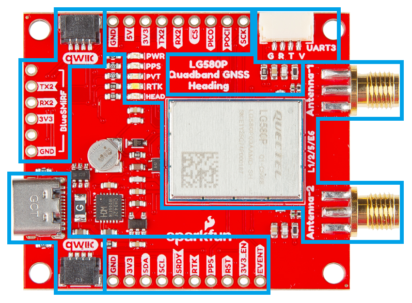
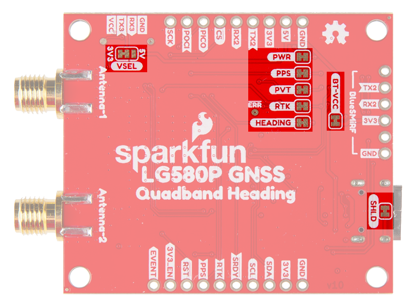

## :material-folder-cog: Design Files
The SparkFun LG580P Quad-band GNSS RTK breakout board's dimensions, pin layout, and connectors are similar to our very popular [SparkFun GPS-RTK-SMA Breakout - ZED-F9P (Qwiic)](https://www.sparkfun.com/sparkfun-gps-rtk-sma-breakout-zed-f9p-qwiic.html) and [SparkFun Quadband GNSS RTK Breakout - LG290P (Qwiic)](https://www.sparkfun.com/sparkfun-quadband-gnss-rtk-breakout-lg290p-qwiic.html) boards, featuring a compact design and convenient Qwiic connectors.

!!! warning "Drop-in Replacement"
	Depending on your appication, this board could potentially function as a drop-in replacement. However, we advise users to verify the pin compatibility of this board with their current installation.

<!-- Import the component -->

-   :kicad-primary:{ .enlarge-logo } Design Files

	---

	- :fontawesome-solid-file-pdf: [Schematic](./assets/board_files/schematic.pdf)
	- :material-folder-zip: [KiCad Files](./assets/board_files/kicad_files.zip)
	- :material-rotate-3d: [STEP File](./assets/3d_model/cad_model.step)
	- :fontawesome-solid-file-pdf: [Board Dimensions](./assets/board_files/dimensions.pdf):
		- 1.70" x 1.80" (43.2mm x 45.7mm)
		- Four mounting holes:
			- 4-40 screw compatible

-   <!-- Boxes in tabs -->

	=== "3D Model"
		<article style="text-align: center;" markdown>
		<model-viewer src="../assets/3d_model/web_model.glb" camera-controls poster="../assets/3d_model/poster.png" tone-mapping="neutral" shadow-intensity="2" shadow-softness="0.2" camera-orbit="0deg 75deg 0.103m" field-of-view="25.11deg" style="width: 100%; height: 450px;">
		</model-viewer>

		[Download the `*.step` File](./assets/3d_model/cad_model.step "Click download"){ .md-button .md-button--primary width="250px" }

		</article>

		???+ tip "Manipulate 3D Model"
			<article style="text-align: center;" markdown>

			| Controls       | Mouse                    | Touchscreen    |
			| :------------- | :----------------------: | :------------: |
			| Zoom           | Scroll Wheel             | 2-Finger Pinch |
			| Rotate         | ++"Left-Click"++ & Drag  | 1-Finger Drag  |
			| Move/Translate | ++"Right-Click"++ & Drag | 2-Finger Drag  |

			</article>

	=== "Dimensions"
		<article style="text-align: center;" markdown>
		[{ width="450" }](./assets/board_files/dimensions.png "Click to enlarge")
		<figcaption markdown>Dimensions of the LG580P GNSS breakout board.</figcaption>
		</article>

		???+ tip "Need more measurements?"
			For more information about the board's dimensions, users can download the [KiCad files](./assets/board_files/kicad_files.zip) for this board. These files can be opened in KiCad and additional measurements can be made with the measuring tool.

			!!! info ":octicons-download-16:{ .heart } KiCad - Free Download!"
				KiCad is free, open-source [CAD]("computer-aided design") program for electronics. Click on the button below to download their software. *(\*Users can find out more information about KiCad from their [website](https://www.kicad.org/).)*

				<article style="text-align: center;" markdown>
				[Download :kicad-primary:{ .enlarge-logo }](https://www.kicad.org/download/ "Go to downloads page"){ .md-button .md-button--primary width="250px" }
				</article>

			???+ info ":straight_ruler: Measuring Tool"
				This video demonstrates how to utilize the dimensions tool in KiCad, to include additional measurements:

				<article class="video-500px" style="text-align: center; margin: auto;" markdown>
				<iframe src="https://www.youtube.com/embed/-eXuD8pkCYw" title="KiCad Dimension Tool" frameborder="0" allow="accelerometer; autoplay; clipboard-write; encrypted-media; gyroscope; picture-in-picture" allowfullscreen></iframe>
				{ .qr width="85" }
				</article>

## Board Layout
The SparkFun LG580P Quad-band GNSS RTK breakout board features the following:

<figure markdown>
[{ width="750" }](./assets/img/hookup_guide/layout.png "Click to enlarge")
<figcaption markdown>Layout of the major components on the breakout board.</figcaption>
</figure>

1. **USB-C Connector**
:   The primary inteface for powering and interacting with the board
1. **LG580P GNSS Module**
:   The Quectel LG580P GNSS module
1. **Header Pins**
:   Exposes pins to power the board and breaks out the interfaces of the LG580P GNSS module
1. **BlueSMiRF Header Pins**
:   Exposes the `UART2` port of the LG580P GNSS module
1. **JST Connector**
:   Exposes the `UART3` port of the LG580P GNSS module
1. **Qwiic Connectors**
:   Exposes the I^2^C interface of the LG580P GNSS module
1. **Status LEDs**
:   LED status indicators for the LG580P GNSS module
1. **`Antenna L1/2/5/6` RF Connectors**
:   SMA connectors for an external GNSS antennas
1. **Backup Battery**
:   Backup power to maintain ephemeris data on the LG580P GNSS module for warm starts

## USB-C Connector
The USB connector is provided to power and communicate with the LG580P GNSS receiver. For most users, it will be the primary method for interfacing with the LG580P.

<figure markdown>
[{ width="400" }](./assets/img/hookup_guide/usb_connector.png "Click to enlarge")
<figcaption markdown>USB-C connector on the Quad-band GNSS RTK breakout board.</figcaption>
</figure>

### CH342 Converter
The CH342 serial-to-USB converter allows users to interface with the `UART1` port of the LG580P GNSS module through the USB-C connector. Although the CH342 provides a dual-channel UART interface, only a single channel is utilized to communicate with the LG580P GNSS module. To utilize the CH342, users may need to install a USB driver, which can be downloaded from the [manufacturer website](https://www.wch-ic.com/search?q=CH342&t=downloads).

Once the USB driver is installed:

- Two virtual `COM` ports will be emulated, which can be used as standard `COM` ports to access the receiver.
- Users should select UART port with the enumeration labeled as `Channel A`.

??? tip "USB Drivers"
	

	-   :material-microsoft-windows: **Windows**

		---

		[:octicons-download-16:{ .heart } Download Page for <code>CH343SER.EXE</code>](https://www.wch-ic.com/downloads/CH343SER_EXE.html){ .md-button .md-button--primary target="blank" }

	-   :material-apple: **MacOS**

		---

		[:octicons-download-16:{ .heart } Download Page for `CH341SER_MAC.ZIP`](https://www.wch-ic.com/downloads/CH34XSER_MAC_ZIP.html){ .md-button .md-button--primary target="blank" }

	

	!!! info "Linux"
		A USB driver is not required for Linux based operating systems.

## Power
The Quad-band GNSS RTK breakout board only requires **3.3V** to power the board's primary components. The simplest method to power the board is through the USB-C connector. Alternatively, the board can also be powered through the other connectors and [PTH](https://en.wikipedia.org/wiki/Through-hole_technology "Plated Through Holes") pins.

<figure markdown>
[{ width="400" }](./assets/img/hookup_guide/power_connections.png "Click to enlarge")
<figcaption markdown>Quad-band GNSS RTK breakout board's power connections.</figcaption>
</figure>

Below, is a general summary of the power circuitry for the board:

- **`5V`** - The voltage from the USB-C connector, usually **5V**.
	- Can be utilized as the primary power source for the entire board.
- **`3V3`** - 3.3V power rail, which powers the LG580P GNSS module, backup battery, and the power LED.
	- Power can also be distributed to/from any of the `3V3` PTH pins or JST connectors *(Qwiic or `UART3`)*.
		- For power that is supplied through these connections, the LG580P requires a supply voltage of **3.0–3.6V**.
	- A regulated **3.3V** is supplied by the [RT9080](./assets/component_documentation/DS9080.pdf), when powered from the `5V` PTH pin or USB connector
		- Input Voltage Range: **1.2 to 5.5V** (1)
		- The RT9080 LDO regulator can source up to 600mA.
- **`3V3_EN`** - Controls the power output from the RT9080 voltage regulator.
	- By default, the pin is pulled-up to 5V and to enable the RT9080 output voltage.
- **`RST`** - Used to reset the LG580P GNSS module
	- Connected to the [`RESET_N` pin](#pio-pins) of the LG580P module, a system pin with an internal pull-up resistor.
	- Driving the pin `LOW` for at least 100ms and releasing it, triggers a hard reset.
- **`GND`** - The common ground or the 0V reference for the voltage supplies.
- [**Backup Battery**](#backup-battery) - Provides backup power to the GNSS module to maintain ephemeris data

1. While the [RT9080](./assets/component_documentation/DS9080.pdf) LDO regulator has an input voltage range of 1.2 - 5.5V, a minimum supply voltage of **3.5V** is recommended for a 3.3V output.

!!! tip "JST Connector"
	The `VCC` pin of the [JST connector](#jst-connector) is designed to operate as a voltage output. However, an input voltage can be supplied through the pin, but users should be mindful of any voltage contention issues.

	Additionally, the `VSEL` jumper can be modified to change to output voltage level of the `VCC` pin.

!!! tip "BlueSMiRF Header"
	The `3V3` pin of the [BlueSMiRF header](#bluesmirf-header) is designed to operate as a voltage output. However, an input voltage can be supplied through the pin, but users should be mindful of any voltage contention issues.

	Additionally, the `BT-VCC` jumper can be modified to change to output voltage level of the `3V3` pin.

!!! info
	For more details, users can reference the [schematic](./assets/board_files/schematic.pdf) and the datasheets of the individual components on the board.

### Power Modes

**Acquisition:**
:   Module searches for satellites and to determine visible satellites, coarse frequency, and the code phase of satellite signals

**Tracking:**
:   Once acquisition is completed, the module tracks satellites and demodulates the navigation data from specific satellites

**Backup Mode:**
:   Reduces power consumption. Only backup domain is active and keeps track of time.

### Power Consumption
The power consumption of the LG580P GNSS module depends on the GNSS signals enabled and the positioning mode.

**Current Consumption:**

- Acquisition: 98mA (323.4mW)
- Tracking: 116mA (382.8mW)
- Backup Mode: 18μA (59.4μW)

### Backup Battery

While charged, the backup battery allows the GNSS module to maintain valid ephemeris data (time and GNSS orbital trajectories) that was stored. Otherwise, the GNSS module must restart [acquiring and tracking satellites](#power-modes).

**Time to First Fix:**

- Cold Start: 28s
- Warm Start: 28s
- Hot Start: 1.8s

## :fontawesome-solid-microchip:&nbsp; LG580P GNSS
The centerpiece of the Quad-band GNSS RTK breakout board, is the [LG580P GNSS module](./assets/component_documentation/quectel_lg580p03_hardware_design_v1-0.pdf) from [Quectel](https://www.quectel.com/). The LG580P is a low-power, multi-band, multi-constellation GNSS receiver capable of delivering centimeter-level precision at high update rates. The built-in professional-grade interference signal detection and elimination algorithms, effectively mitigate multiple narrow-band interference sources and significantly improve signal reception performance in complex electromagnetic environments. In addition, the RTK and heading algorithms ensure reliable positioning in challenging scenarios such as urban environments and deep tree cover. With its performance advantages of high-precision and power consumption, this board is an ideal choice for high-precision navigation applications, such as intelligent robots, UAVs, precision agriculture, mining, surveying, and autonomous navigation.

<figure markdown>
[{ width="300" }](./assets/img/hookup_guide/LG580P.png "Click to enlarge")
<figcaption markdown>The LG580P module on the Quad-band GNSS RTK breakout board.</figcaption>
</figure>

<article class="video-500px" style="text-align: center; margin: auto;" markdown>
<iframe src="https://player.vimeo.com/video/1115089915?h=127c90c2a9" title="Quectel: Product Intro for LG580P GNSS Module" frameborder="0" allow="accelerometer; autoplay; clipboard-write; encrypted-media; gyroscope; picture-in-picture" allowfullscreen></iframe>
{ .qr width=100 }
</article>

??? info "General Features"
	

	

	- Supply Voltage: **3.0–3.6V**
	- Tracking Channels: 1040
	- Concurrent signal reception: 5 + QZSS
		- `L1`, `L2`, `L5`, `E6` frequency bands
	- Sensitivity:
		- Acquisition: -145dBm
		- Tracking: -160dBm
		- Reacquisition: -155dBm
	- Antenna Power: External
	- GNSS Constellations and SBAS Systems:
		- **USA:** GPS + WASS
		- **Russia:** GLONASS + SDCM
		- **EU:** Galileo + EGNOS
		- **China:** BDS + BDSDAS
		- **Japan:** QZSS + MSAS
		- **India:** NavIC + GAGAN
		- **Korea:** KASS
		- **Africa:** ASECNA
		- **Auz/NZ:** SouthPAN
	- Accuracy of 1PPS Signal: 5ns
	- Update Rate:
		- Default: 10Hz
		- Max: 20Hz

	

	

	- Time to First Fix *(without AGNSS)*:
		- Cold Start: 28s
		- Warm Start: 28s
		- Hot Start: 1.8s
	- RTK Convergence Time: 5s
	- Dynamic Performance:
		- Maximum Altitude: 10000m
		- Maximum Velocity: 490m/s
		- Maximum Acceleration: 4g
	- Interfaces
		- UART (x3)
			- Baud Rate: 9600–3000000bps
				- **Default:** 460800bps
			- Protocol: `NMEA 0183`/`RTCM 3.x`/`QGC`
		- SPI[^1] (x1)
		- I^2^C[^1] (x1)
		- CAN[^1] (x1)
	- Operating temperature: -40&deg;C to +85&deg;C
	- Footprint: 21mm × 16mm × 2.7mm
	- Weight: 1.4g

	

	

	[^1]:
		!!! warning "Feature Under Development"
			Currently, only the UART interface is supported by the module. Support for the **I^2^C**, **SPI**, and **CAN** interfaces are still under development.

### Frequency Bands
The LG580P modules are multi-band, multi-constellation GNSS receivers. Below, is a chart illustrating the frequency bands utilized by all the global navigation satellite systems; along with a list of the frequency bands and GNSS systems supported by the LG580P GNSS module.

<figure markdown>
[{ width="800" style="background-color:white"}](https://www.tallysman.com/app/uploads/2021/07/Tallysman-GNSS-Frequencies-v8.0_Chart-1-1024x425.png "Click to enlarge")
<figcaption markdown>Frequency bands of the global navigation satellite systems. (Source: [Tallysman](https://www.tallysman.com/gnss-constellations-radio-frequencies-and-signals/))</figcaption>
</figure>

**Supported Frequency Bands:**

- GPS: `L1 C/A`, `L5`, `L2C`
- GLONASS: `L1`, `L2`
- Galileo: `E1`, `E5a`, `E5b`, `E6`
- BDS: `B1I`, `B1C`, `B2a`, `B2b`, `B2I`, `B3I`
- QZSS: `L1 C/A`, `L5`, `L2C`, `L6`
- NavIC: `L5`
- SBAS: `L1`
- L-band PPP[^2]:
	- PPP: `B2b`
	- QZSS: `L6`
	- Galileo HAS: `E6`

**Supported GNSS Constellations:**

- GPS (USA)
- GLONASS (Russia)
- Galileo (EU)
- BDS (China)
- QZSS (Japan)
- NavIC (India)

**Supported SBAS Systems:**

- WASS (USA)
- SDCM (Russia)
- EGNOS (EU)
- BDSBAS (China)
- MSAS (Japan)
- GAGAN (India)
- KASS (Korea)
- ASECNA (Africa)
- SouthPAN (Aus/NZ)

[^2]:
	!!! warning "Feature Under Development"
		Corrections for some of the PPP services have not been implemented.

!!! info
	For a comparison of the frequency bands supported by the LG580P GNSS modules, refer to sections **1.2**, **1.5**, and **1.6** of the [hardware design manual](./assets/component_documentation/quectel_lg580p03_hardware_design_v1-0.pdf).

??? tip "What are Frequency Bands?"
	A [frequency band](https://en.wikipedia.org/wiki/Frequency_band) is a section of the [electromagnetic spectrum](https://en.wikipedia.org/wiki/Electromagnetic_spectrum), usually denoted by the range of its upper and lower limits. In the [radio spectrum](https://en.wikipedia.org/wiki/Radio_spectrum), these frequency bands are usually regulated by region, often through a government entity. This regulation prevents the interference of RF communication; and often includes major penalties for any interference with critical infrastructure systems and emergency services.

	<figure markdown>
	[{ width="400" }](https://gssc.esa.int/navipedia/images/c/cf/GNSS_All_Signals.png "Click to enlarge")
	<figcaption markdown>Frequency bands of the global navigation satellite systems. (Source: [ESA](https://gssc.esa.int/navipedia/index.php?title=File:GNSS_All_Signals.png "European Space Agency"))</figcaption>
	</figure>

	However, if the various GNSS constellations share similar frequency bands, then how do they avoid interfering with one another? Without going too far into detail, the image above helps illustrate some of the characteristics, specific to the frequency bands of each system. With these characteristics in mind, along with other factors, the chart can help users to visualize how multiple GNSS constellations might co-exist with each other.

	For more information, users may find these articles of interest:

	- [GNSS signal](https://gssc.esa.int/navipedia/index.php/GNSS_signal)
	- [GPS Signal Plan](https://gssc.esa.int/navipedia/index.php?title=GPS_Signal_Plan)
	- [GLONASS Signal Plan](https://gssc.esa.int/navipedia/index.php?title=GLONASS_Signal_Plan)
	- [GALILEO Signal Plan](https://gssc.esa.int/navipedia/index.php?title=GALILEO_Signal_Plan)

### GNSS Accuracy
The accuracy of the position reported from the LG580P GNSS module, can be improved based upon the correction method being employed. Currently, [RTK](https://en.wikipedia.org/wiki/Real-time_kinematic_positioning "Real-Time Kinematic") corrections provide the highest level of accuracy; however, users should be aware of certain limitations of the system:

- RTK technique requires real-time correction data from a reference station or network of base stations.
	- RTK corrections usually come from RTCM messages that are signal specific *(i.e. an RTK network may only provide corrections for specific signals; only `E5b` and not `E5a`)*.
- The range of the base stations will vary based upon the method used to transmit the correction data.
- The reliability of RTK corrections are inherently reduced in [multipath environments](https://en.wikipedia.org/wiki/Multipath_propagation).

<article style="text-align: center;" markdown>

| Correction Method                                                                             | Horizontal                   | Vertical                 | Heading  | Velocity                                |
| :-------------------------------------------------------------------------------------------- | :--------------------------: | :----------------------: | :------: | :-------------------------------------: |
| Standalone                                                                                    | 1.0m ~3.3'                | 1.5m ~4.9'            |          | 3cm/s (0.108kph) ~1.2in/s (0.067mph) |
| [RTK](https://en.wikipedia.org/wiki/Real-time_kinematic_positioning "Real-Time Kinematic")    | **0.8cm** *(+1ppm)* ~0.3" | 1.5cm *(+1ppm)* ~0.6" | 0.1&deg; |                                         |

</article>

??? info "RTK Corrections"
	To understand how RTK works, users will need a more fundamental understanding of the signal error sources.

	

	-   <a href="https://www.sparkfun.com/news/7533">
		<figure markdown>
		
		</figure>

		---

		**Real-Time Kinematics Explained**</a>

	-   <a href="https://www.sparkfun.com/news/7138">
		<figure markdown>
		
		</figure>

		---

		**What is Correction Data?**</a>

	

## Peripherals and I/O Pins
The LG580P GNSS features several peripheral interfaces and I/O pins. Some of these are broken out as pins on the Quad-band GNSS RTK breakout board; whereas, others are broken out to their specific interface *(i.e. USB connector, JST connector, etc.)*. Additionally, some of their connections are tied to other components on the board.

<figure markdown>
[{ width="400" }](./assets/img/hookup_guide/headers-all.png "Click to enlarge")
<figcaption markdown>The I/O pins on the Quad-band GNSS RTK breakout board.</figcaption>
</figure>

**Interfaces:**

- UART (x3)
- ~~SPI[^1]~~
- ~~I^2^C[^1]~~
- ~~CAN[^1]~~
- ~~Event Trigger[^3]~~
- PPS Signal
- RTK Signal
- Module Reset

[^3]:
	!!! warning "Feature Under Development"
		The event trigger has not been implemented.

=== "UARTs"
	

	

	The LG580P GNSS has three UART ports, which can be operated and configured separately.

	<figure markdown>
	[{ width="400" }](./assets/img/hookup_guide/uart_ports.png "Click to enlarge")
	<figcaption markdown>The UART ports on the Quad-band GNSS RTK breakout board.</figcaption>
	</figure>

	??? tip "Pin Connections"
		When connecting to the UART pins to another device, the signals should be connected based upon the flow of their data.

		<article style="text-align: center;" markdown>

		<table>
		<tr>
		<th>Board</th>
		<td align="center">RX</td>
		<td align="center">TX</td>
		<td align="center">GND</td>
		</tr>
		<tr>
		<th>UART Device</th>
		<td align="center">TX</td>
		<td align="center">RX</td>
		<td align="center">GND</td>
		</tr>
		</table>

		</article>

	

	

	!!! info "UART Settings"
		The UART ports have the following configuration settings:

		- Logic Level: **3.3V**
		- Baudrate: 9600bps, 115200bps, 230400bps, 460800bps, 921600bps, and 3000000bps 
		- Data Bits: 8
		- Parity: No
		- Stop Bits: 1
		- Flow Control: N/A
		- Supported Protocols:
			- `NMEA 0183` (`PQTM`)
			- `RTCM 3.x`
			- `QGC`

		??? note "Additional Support"
			All of the UART ports support firmware updates through their interface. In addition, the `UART1` port also supports debugging data and the `UART3` interface can be multiplexed for the CAN bus interface[^1].

	

	

	=== "`UART1`"
		`UART1` can only be accessed from the [USB-C connector](#usb-c-connector), through the CH342 serial-to-USB converter. For Windows and MacOS computers, a [USB driver must be installed](#ch342-converter) in order to communicate with the LG580P module through the CH342 converter; however for Linux operating systems, the standard Linux CDC-ACM driver is suitable. Once the USB driver has been installed:

		- Two virtual `COM` ports are emulated, which can be used as standard `COM` ports to access the receiver.
		- Users should select `COM` port with the lower enumeration or listed as `Channel A`.

	=== "`UART2`"
		`UART2` is available through the breakout [PTH](https://en.wikipedia.org/wiki/Through-hole_technology "Plated Through Holes") pins or the [BlueSMiRF header pins](#bluesmirf-header). The pin layout of the BlueSMiRF header is pin compatible with many of our serial devices (i.e. [UART adapters](https://www.sparkfun.com/categories/349), [*serial* data loggers](https://www.sparkfun.com/categories/589), [BlueSMiRF transceivers](https://www.sparkfun.com/categories/tags/bluesmirf)).

	=== "`UART3`"
		`UART3` is available through the [JST connector](#jst-connector). The pin layout of the 4-pin locking JST-GH connector is compatible with many of our [serial radios and adapter cables](hardware_assembly.md#radio-transceivers).

	??? info "UART Protocols"
		#### UART Protocols
		By default, these UART ports are configured to transmit and receive `NMEA 0183`, `RTCM 3.x`, and/or `QGC` messages. These messages are generally used for transmitting PNT data; providing or receiving RTK corrections; and receiving PPP data, respectively. Quectel also implements a system of proprietary messages (`PQTM`) for users to configure the LG580P that follows a data format similar to the `NMEA` protocol. The expected structure of these proprietary messages is shown below:

		

		

		<figure markdown>
		[{ width="600" }](./assets/img/hookup_guide/nmea_protocol.png "Click to enlarge")
		<figcaption markdown>The data structure of Quectel messages for the `NMEA` and `PQTM` protocols.</figcaption>
		</figure>

		

		

		<figure markdown>
		[{ width="600" }](./assets/img/hookup_guide/qgc_protocol.png "Click to enlarge")
		<figcaption markdown>The data structure of Quectel messages for the `QGC` protocol.</figcaption>
		</figure>

		

		

		=== "NMEA"
			A full list of compatible `NMEA 0183` v4.11 messages, is provided in section **2.2. Standard Messages** of the [GNSS Protocol Specification](./assets/component_documentation/quectel_lg290p03lgx80p03_gnss_protocol_specification_v1-1.pdf) manual. This protocol is used for outputting GNSS data, as detailed by the [National Marine Electronics Association](https://www.nmea.org/) organization.

			??? abstract "List of Standard NMEA Messages"
				<article style="text-align: center;" markdown>

				| Message | Type Mode | Message Description               |
				| :-----: | :-------: | :-------------------------------- |
				| RMC | Output | Recommended Minimum Specific GNSS Data   |
				| GGA | Output | Global Positioning System Fix Data       |
				| GSV | Output | GNSS Satellites in View                  |
				| GSA | Output | GNSS DOP and Active Satellites           |
				| VTG | Output | Course Over Ground & Ground Speed        |
				| GLL | Output | Geographic Position – Latitude/Longitude |
				| GBS | Output | GNSS Satellite Fault Detection           |
				| GNS | Output | GNSS Fix Data                            |
				| GST | Output | GNSS Pseudorange Error Statistics        |
				| ZDA | Output | UTC Time & Date                          |
				| HDT | Output | True Vessel Heading                      |
				| THS | Output | True, Heading, and Status                |

				</article>

		=== "PQTM"
			A full list of PQTM messages (proprietary NMEA messages defined by Quectel) supported by LG580P, is provided in section **2.3. PQTM Messages** of the [GNSS Protocol Specification](./assets/component_documentation/quectel_lg290p03lgx80p03_gnss_protocol_specification_v1-1.pdf) manual. This protocol is used to configure or read the settings for the LG580P GNSS module.

			??? abstract "List of Proprietary Quectel Messages"
				<article style="text-align: center;" markdown>

				| Message            | Type Mode    | Message Description                              |
				| :----------------- | :----------: | :----------------------------------------------- |
				| PQTMVER            | Output       | Outputs the firmware version                     |
				| PQTMCOLD           | Command      | Performs a cold start                            |
				| PQTMWARM           | Command      | Performs a warm start                            |
				| PQTMHOT            | Command      | Performs a hot start                             |
				| PQTMSRR            | Command      | Performs a system reset and reboots the receiver |
				| PQTMUNIQID         | Command      | Queries the module unique ID                     |
				| PQTMSAVEPAR        | Command      | Saves the configurations into NVM                |
				| PQTMRESTOREPAR     | Command      | Restores the parameters configured by all commands to their default values |
				| PQTMVERNO          | Command      | Queries the firmware version                     |
				| PQTMCFGUART        | Set/Get      | Sets/gets the UART interface                     |
				| PQTMCFGPPS         | Set/Get      | Sets/gets the PPS feature                        |
				| PQTMCFGPROT        | Set/Get      | Sets/gets the input and output protocol for a specified port |
				| PQTMCFGNMEADP      | Set/Get      | Sets/gets the decimal places of standard NMEA messages |
				| PQTMEPE            | Output       | Outputs the estimated position error             |
				| PQTMCFGMSGRATE     | Set/Get      | Sets/gets the message output rate on the current interface |
				| PQTMVEL            | Output       | Outputs the velocity information                 |
				| PQTMCFGGEOFENCE    | Set/Get      | Sets/gets geofence feature                       |
				| PQTMGEOFENCESTATUS | Output       | Outputs the geofence status                      |
				| PQTMGNSSSTART      | Command      | Starts GNSS engine                               |
				| PQTMGNSSSTOP       | Command      | Stops GNSS engine                                |
				| PQTMTXT            | Output       | Outputs short text messages                      |
				| PQTMCFGSVIN        | Set/Get      | Sets/gets the Survey-in feature                  |
				| PQTMSVINSTATUS     | Output       | Outputs the Survey-in status                     |
				| PQTMPVT            | Output       | Outputs the PVT (GNSS only) result               |
				| PQTMCFGRCVRMODE    | Set/Get      | Sets/gets the receiver working mode              |
				| PQTMDEBUGON        | Command      | Enables debug log output                         |
				| PQTMDEBUGOFF       | Command      | Disables debug log output                        |
				| PQTMCFGFIXRATE     | Set/Get      | Sets/gets the fix interval                       |
				| PQTMCFGRTK         | Set/Get      | Sets/gets the RTK mode                           |
				| PQTMCFGCNST        | Set/Get      | Sets/gets the constellation configuration        |
				| PQTMDOP            | Output       | Outputs dilution of precision                    |
				| PQTMPL             | Output       | Outputs protection level information             |
				| PQTMCFGODO         | Set/Get      | Sets/gets the odometer feature                   |
				| PQTMRESETODO       | Command      | Resets the accumulated distance recorded by the odometer |
				| PQTMODO            | Output       | Outputs the odometer information                 |
				| PQTMCFGSIGNAL      | Set/Get      | Sets/gets GNSS signal mask                       |
				| PQTMCFGSAT         | Set/Get      | Sets/gets GNSS satellite mask                    |
				| PQTMCFGRSID        | Set/Get      | Sets/gets the reference station ID               |
				| PQTMCFGRTCM        | Set/Get      | Sets/gets RTCM                                   |
				| PQTMCFGSBAS        | Set/Get      | Configures SBAS                                  |
				| PQTMCFGNMEATID     | Set/Get      | Configures the NMEA Talker ID                    |
				| PQTMTAR            | Output       | Outputs the time and attitude                    |
				| PQTMCFGBLD         | Set/Get      | Configures the baseline distance                 |
				| PQTMCFGRTKSRCTYPE  | Set/Get      | Configures RTK differential source type          |
				| PQTMSN             | Command      | Reads the SN of module                           |
				| PQTMCFGANTINF      | Set/Get      | Configures the antenna information               |
				| PQTMCFGANTDELTA    | Set/Get      | Configures the delta between antennas            |
				| PQTMCFGSIGGRP      | Set/Get      | Configures the GNSS signal group                 |
				| PQTMCFGSIGNAL2     | Set/Get      | Configures GNSS signal mask for second antenna   |
				| PQTMCFGGEOSEP      | Set/Get      | Configures geoidal separation                    |
				| PQTMCFGCNRTHD      | Set/Get      | Configures the CNR threshold for position engine |
				| PQTMCFGELETHD      | Set/Get      | Configures the elevation threshold for position engine |
				| PQTMNAV            | Output       | Outputs the navigation information               |
				| PQTMEOE            | Output       | Outputs the end of epoch information             |
				| PQTMCFGWN          | Set/Get      | Configures the reference start week number       |
				| PQTMANTENNASTATUS  | Output       | Reports the antenna status                       |

				</article>

		=== "QGC"
			A full list of QGC messages (proprietary protocol defined by Quectel) supported by LG580P, is provided in section **3. QGC Protocol** of the [GNSS Protocol Specification](./assets/component_documentation/quectel_lg290p03lgx80p03_gnss_protocol_specification_v1-1.pdf) manual. This protocol is used to output the PPP raw data.

			??? abstract "List of Proprietary Quectel Messages"
				<article style="text-align: center;" markdown>

				| GQC Message Name | Message Group | Message Number | Type | Description |
				| :--------- | :--: | :--: | :----: | :--------------------------------- |
				| RAW-PPPB2B | 0x0A | 0xB2 | Output | BDS PPPB2B binary raw messages     |
				| RAW-QZSSL6 | 0x0A | 0xB6 | Output | QZSSL6 binary raw messages         |
				| RAW-HASE6  | 0x0A | 0xE6 | Output | Galileo HASE6 binary raw messages  |

				</article>

		=== "RTCM"
			A full list of compatible `RTCM v3` messages, is provided in section **4. RTCM Protocol** of the [GNSS Protocol Specification](./assets/component_documentation/quectel_lg290p03lgx80p03_gnss_protocol_specification_v1-1.pdf) manual. This protocol is used for transferring GNSS raw measurement data, as detailed by the [Radio Technical Commission for Maritime Services](https://www.rtcm.org/) organization.

			??? abstract "List of Supported RTCMv3 *(MSM)* Messages"
				<article style="text-align: center;" markdown>

				| Message | Type Mode | Message Description                              |
				| :--: | :----------: | :----------------------------------------------- |
				| 1005 | Input/Output | Stationary RTK Reference Station ARP             |
				| 1006 | Input/Output | Stationary RTK Reference Station ARP with height |
				| 1019 | Input/Output | GPS Ephemerides                                  |
				| 1020 | Input/Output | GLONASS Ephemerides                              |
				| 1041 | Input/Output | NavIC/IRNSS Ephemerides                          |
				| 1042 | Input/Output | BDS Satellite Ephemeris Data                     |
				| 1044 | Input/Output | QZSS Ephemerides                                 |
				| 1046 | Input/Output | Galileo I/NAV Satellite Ephemeris Data           |
				| 1073 | Input/Output | GPS MSM3 |
				| 1074 | Input/Output | GPS MSM4 |
				| 1075 | Input/Output | GPS MSM5 |
				| 1076 | Input/Output | GPS MSM6 |
				| 1077 | Input/Output | GPS MSM7 |
				| 1083 | Input/Output | GLONASS MSM3 |
				| 1084 | Input/Output | GLONASS MSM4 |
				| 1085 | Input/Output | GLONASS MSM5 |
				| 1086 | Input/Output | GLONASS MSM6 |
				| 1087 | Input/Output | GLONASS MSM7 |
				| 1093 | Input/Output | Galileo MSM3 |
				| 1094 | Input/Output | Galileo MSM4 |
				| 1095 | Input/Output | Galileo MSM5 |
				| 1096 | Input/Output | Galileo MSM6 |
				| 1097 | Input/Output | Galileo MSM7 |
				| 1113 | Input/Output | QZSS MSM3 |
				| 1114 | Input/Output | QZSS MSM4 |
				| 1115 | Input/Output | QZSS MSM5 |
				| 1116 | Input/Output | QZSS MSM6 |
				| 1117 | Input/Output | QZSS MSM7 |
				| 1123 | Input/Output | BDS MSM3 |
				| 1124 | Input/Output | BDS MSM4 |
				| 1125 | Input/Output | BDS MSM5 |
				| 1126 | Input/Output | BDS MSM6 |
				| 1127 | Input/Output | BDS MSM7 |
				| 1133 | Input/Output | NavIC/IRNSS MSM3 |
				| 1134 | Input/Output | NavIC/IRNSS MSM4 |
				| 1135 | Input/Output | NavIC/IRNSS MSM5 |
				| 1136 | Input/Output | NavIC/IRNSS MSM6 |
				| 1137 | Input/Output | NavIC/IRNSS MSM7 |

				</article>

=== "I^2^C"
	

	

	While not implemented yet, the I^2^C interface is available through the breakout [PTH](https://en.wikipedia.org/wiki/Through-hole_technology "Plated Through Holes") pins or the Qwiic connectors.

	<figure markdown>
	[{ width="400" }](./assets/img/hookup_guide/i2c.png "Click to enlarge")
	<figcaption markdown>The I^2^C interface on the Quad-band GNSS RTK breakout board.</figcaption>
	</figure>

	

	

	!!! info "I^2^C Settings"
		By default, the UART ports are configured with the following settings:

		- Logic Level: **3.3V**
		- I^2^C Address: N/A
		- Bitrate: up to **400kbps**
		- Protocols:
			- `NMEA`
			- `PQTM`
			- `RTCM`
		- Built-in 2.2k&ohm; pull-up resistors

	

	

=== "SPI"
	

	

	While not implemented yet, the SPI interface is available through the breakout [PTH](https://en.wikipedia.org/wiki/Through-hole_technology "Plated Through Holes") pins.

	<figure markdown>
	[{ width="400" }](./assets/img/hookup_guide/spi.png "Click to enlarge")
	<figcaption markdown>The SPI interface on the Quad-band GNSS RTK breakout board.</figcaption>
	</figure>

	

	

	!!! info "SPI Settings"
		By default, the UART ports are configured with the following settings:

		- Logic Level: **3.3V**
		- Baudrate: 1Mbps – 3Mbps
		- Protocols:
			- `NMEA`
			- `PQTM`
			- Firmware updates

	!!! note "`SRDY` Pin"
		The `SDRY` pin functions as the interrupt output for the SPI interface. By default, the pin is `LOW`.

	

	

=== "PPS Output"
	From the module, the [PPS](https://en.wikipedia.org/wiki/Pulse-per-second_signal "Pulse Per Second") output signal is a 3.3V signal output that can be accessed from the `PPS` [PTH](https://en.wikipedia.org/wiki/Through-hole_technology "Plated Through Holes") pin. The signal is also connected to the `PPS` LED, which can be used as a visual indicator for its operation.

	<figure markdown>
	[{ width="400" }](./assets/img/hookup_guide/pps_signal.png "Click to enlarge")
	<figcaption markdown>The timing signal's outputs on the Quad-band GNSS RTK breakout board.</figcaption>
	</figure>

	???+ tip "Jumpers"
		*See the **[Jumpers](#jumpers)** section for more details.*

		- There is a jumper attached to the `PPS` LED. For low power applications, the jumper can be cut to disable the `PPS` LED.

	!!! tip "Use Case"
		- Users could use this signal in conjunction with the event pins to synchronize two modules with each other.
		- Users could use this signal to create their own **Stratum 0** source for the [NTP](https://en.wikipedia.org/wiki/Network_Time_Protocol "Network Time Protocol") on a primary time server.

=== "RTK"
	The `RTK` [PTH](https://en.wikipedia.org/wiki/Through-hole_technology "Plated Through Holes") pin operates as the `RTK_STAT` status indicator for the [RTK](https://en.wikipedia.org/wiki/Real-time_kinematic_positioning "Real-Time Kinematic") positioning. The pin is also connected to the `RTK` LED, which can be used as a visual indicator for its operation.

	<figure markdown>
	[{ width="400" }](./assets/img/hookup_guide/rtk_signal.png "Click to enlarge")
	<figcaption markdown>The RTK signal's outputs on the Quad-band GNSS RTK breakout board.</figcaption>
	</figure>

	!!! info
		The `RTK_STAT` pin is used to indicate [RTK](https://en.wikipedia.org/wiki/Real-time_kinematic_positioning "Real-Time Kinematic") status. The pin is at high level during startup.

		1. If the pin output is high, it indicates the module has entered the RTK fixed mode.
		2. If the pin output is low, it indicates that the module exited the RTK fixed mode or is in [Backup mode](#power-modes).
		3. If the pin outputs an alternating pin level, it indicates that the module received the correct RTCM data and did not enter the RTK fixed mode. The default frequency is 10Hz.

	???+ tip "Jumpers"
		*See the **[Jumpers](#jumpers)** section for more details.*

		- There is a jumper attached to the `RTK` LED. For low power applications, the jumper can be cut to disable the `RTK` LED.

=== "Event"
	The `EVENT` pin provides event inputs with adjustable input frequentness and polarity.

	<figure markdown>
	[{ width="400" }](./assets/img/hookup_guide/event.png "Click to enlarge")
	<figcaption markdown>The `EVENT` pin on the Quad-band GNSS RTK breakout board.</figcaption>
	</figure>

	!!! tip "Use Case"
		Users could use this pin in conjunction with the PPS signal to synchronize two modules with each other.

=== "Reset"
	The `RST` pin can be used to reset the LG580P module if it enters an abnormal state. To reset the GNSS module, the pin must be low for more than 100ms.

	<figure markdown>
	[{ width="400" }](./assets/img/hookup_guide/reset.png "Click to enlarge")
	<figcaption markdown>The `RST` pin on the Quad-band GNSS RTK breakout board.</figcaption>
	</figure>

## SMA Connectors
There are two SMA connectors on the Quad-band GNSS RTK breakout board. The `Antenna-1` connector is the primary input for a GNSS antenna for the LG580P GNSS receiver. The `Antenna-2` connector operates as a secondary GNSS antenna input to provide a heading and pitch solution from the LG580P GNSS receiver.

<figure markdown>
[{ width="400" }](./assets/img/hookup_guide/ant.png "Click to enlarge")
<figcaption markdown>The SMA connectors for an external GNSS antennas on the Quad-band GNSS RTK breakout board.</figcaption>
</figure>

!!! warning "Antenna Specifications"
	- Passive antennas are not recommended for the LG580P GNSS module.
	- To mitigate the impact of out-of-band signals, utilize an active antenna whose SAW filter is placed in front of the LNA in the internal framework.
		- **DO NOT** select and antenna with the LNA placed in the front.
	- There is no need to inject an external DC voltage into the SMA connector for the GNSS antenna. Power is already provided from the LG580P module for the LNA of an active antenna.

!!! tip
	For the best performance, we recommend users choose compatible L1/L2/L5/L6/L-Band GNSS antennas and utilize a low-loss cables. Also, don't forget that GNSS signals are fairly weak and can't penetrate buildings or dense vegetation. The GNSS antennas should have an unobstructed view of the sky.

## JST Connector
The Quad-band GNSS RTK breakout features a 4-pin [JST GH connector](./assets/component_documentation/JST-GH_datasheet.pdf), which is polarized and locking. Users can access pins of the `UART3` port with our [breadboard cable](https://www.sparkfun.com/breadboard-to-jst-ghr-04v-cable-4-pin-x-1-25mm-pitch.html). Otherwise, the connector's pin layout is compatible with any of our [serial radios and adapter cables](hardware_assembly.md#radio-transceivers).

<figure markdown>
[{ width="400" }](./assets/img/hookup_guide/jst-connector.png "Click to enlarge")
<figcaption markdown>The JST connector on the Quad-band GNSS RTK breakout board.</figcaption>
</figure>

??? info "Pin Connections"
	#### Pin Connections
	When connecting the Quad-band GNSS RTK breakout board to other products, users need to be aware of the pin connections between the devices.

	<article style="text-align: center;" markdown>

	<table border="1" markdown>
	<tr>
	<th style="vertical-align:middle;">Pin Number</th>
	<td align="center">
		**1** 
		*(Left Side)*
	</td>
	<td align="center">**2**</td>
	<td align="center">**3**</td>
	<td align="center">**4**</td>
	</tr>
	<tr>
	<th>Label</th>
	<td align="center">VCC</td>
	<td align="center">TX3</td>
	<td align="center">RX3</td>
	<td align="center">GND</td>
	</tr>
	<tr>
	<th style="vertical-align:middle;">Function</th>
	<td>
		<u>**Voltage Output**</u> 
		- **Default: 3.3V** 
		- Selectable: 3.3V or 5V
	</td>
	<td align="center" style="vertical-align:middle;">`UART3` - Receive</td>
	<td align="center" style="vertical-align:middle;">`UART3` - Transmit</td>
	<td align="center" style="vertical-align:middle;">Ground</td>
	</tr>
	</table>

	</article>

	

	

	When connecting the Quad-band GNSS RTK breakout board to our radios, the pin connections should follow the table below. If the flow control is not enabled, the only the `RX`, `TX`, and `GND` pins are utilized.

	<article style="text-align: center;" markdown>

	<table markdown>
	<tr>
	<th>Board</th>
	<td align="center">RX</td>
	<td align="center">TX</td>
	<td align="center">GND</td>
	</tr>
	<tr>
	<th>Radio</th>
	<td align="center">TX</td>
	<td align="center">RX</td>
	<td align="center">GND</td>
	</tr>
	</table>

	</article>

	

	

	As documented in the [LoRaSerial product manual](https://docs.sparkfun.com/SparkFun_LoRaSerial), the pin connections between a host system *(i.e. Quad-band GNSS RTK breakout board)* and the LoRaSerial Kit radio is outlined in the image below.

	<figure markdown>
	[{ width="400" }](https://docs.sparkfun.com/SparkFun_LoRaSerial/img/SAMD21%20Flow%20control.png "Click to enlarge")
	<figcaption markdown>The `COM` ports on the Quad-band GNSS RTK breakout board.</figcaption>
	</figure>

	

	

???+ tip "Jumpers"
	By default, the [`VSEL` jumper](#jumpers) is connected to `3V3` pad for a regulated 3.3V output on the 4-pin JST-GH connector.

## BlueSMiRF Header
The Quad-band GNSS RTK breakout features a 6-pin BlueSMiRF [PTH](https://en.wikipedia.org/wiki/Through-hole_technology "Plated Through Holes") header for `UART2`. The pin layout of which, is compatible with many of our serial devices (i.e. [UART adapters](https://www.sparkfun.com/categories/349), [*serial* data loggers](https://www.sparkfun.com/categories/589), [BlueSMiRF transceivers](https://www.sparkfun.com/categories/tags/bluesmirf)).

<figure markdown>
[{ width="400" }](./assets/img/hookup_guide/header-bluesmirf.png "Click to enlarge")
<figcaption markdown>The 6-pin BlueSMiRF PTH header on the Quad-band GNSS RTK breakout board.</figcaption>
</figure>

???+ tip "Jumpers"
	By default, the [`BT_VCC` jumper](#jumpers) provides a regulated 3.3V output to the BlueSMiRF header.

## Status LEDs

There are four status LEDs on the Quad-band GNSS RTK breakout board:

<figure markdown>
[{ width="400" }](./assets/img/hookup_guide/LEDs.png "Click to enlarge")
<figcaption markdown>The status LED indicators on the Quad-band GNSS RTK breakout board.</figcaption>
</figure>

- `PWR` - Power *(Red)*
	- Turns on once 3.3V power is supplied to the board
- `PPS` - [Pulse-Per-Second](https://en.wikipedia.org/wiki/Pulse-per-second_signal) Signal *(Yellow)*
	- Indicates when there is a pulse-per-second signal *(see the **[PPS Output](#pps-output)** section)*
- `PVT` - Position-Velocity-Time Solution *(Blue)*
	- **On:** Indicates the module has entered PVT mode
	- **Off:** Indicates that the module has exited PVT mode or is in [Backup mode](#power-modes).
- `RTK` - [Real-Time Kinematic](https://en.wikipedia.org/wiki/Real-time_kinematic_positioning) Mode *(White)*
	- Indicates when an RTK fix has been established or when the correct RTCM data is being received *(see the **[RTK](#rtk)** section)*
- `HEAD` - Heading Solution *(Green)*
	- **On:** Indicates the module has entered Heading fixed mode
	- **Off:** Indicates that the module has exited Heading fixed mode or is in [Backup mode](#power-modes).

!!! info
	- The [`PPS`](https://en.wikipedia.org/wiki/Pulse-per-second_signal "Pulse Per Second") LED is also connected to the [`PPS` pin](#pps-output).
	- The [`RTK`](https://en.wikipedia.org/wiki/Real-time_kinematic_positioning "Real-Time Kinematic") LED is also connected to the [`RTK` pin](#rtk).

???+ tip "Jumpers"
	There are jumper attached to the LEDs. For low power applications, these jumpers can be cut to disable their respective LED. *See the **[Jumpers](#jumpers)** section for more details.*

## Jumpers

??? note "Never modified a jumper before?"
	Check out our <a href="https://learn.sparkfun.com/tutorials/664">Jumper Pads and PCB Traces tutorial</a> for a quick introduction!

	

	-   <a href="https://learn.sparkfun.com/tutorials/664">
		<figure markdown>
		
		</figure>

		---

		**How to Work with Jumper Pads and PCB Traces**</a>

	

There are seven jumpers on the back of the board that can be used to easily modify the hardware connections on the board. From which, there are three jumpers that control power to the status LEDs on the board. By default, all the jumpers are connected, to power the status LEDs. For low power applications, users can cut the jumpers to disconnect power from each of the LEDs.

<figure markdown>
[{ width="400" }](./assets/img/hookup_guide/jumpers.png "Click to enlarge")
<figcaption markdown>The jumpers on the back of the Quad-band GNSS RTK breakout board.</figcaption>
</figure>

- **`VSEL`** - This jumper can be modified to configure/disconnect the `VCC` pin of the 4-pin locking JST connector to/from `3V3` or `5V` power.
- **`BT_VCC`** - This jumper can be cut to disconnect the `3V3` BlueSMiRF header pin from the 3.3V output of the RT9080 LDO regulator.
- **`PWR`** - This jumper can be cut to remove power from the red, power LED.
- **`PPS`** - This jumper can be cut to remove power from the yellow `PPS` LED, indicating when there is a [PPS](https://en.wikipedia.org/wiki/Pulse-per-second_signal "Pulse Per Second") signal.
- **`PVT`** - This jumper can be cut to remove power from the blue `PVT` LED, indicating a PVT solution or operation in PVT mode.
- **`RTK`** - This jumper can be cut to remove power from the white `RTK` LED, indicating RTK fix or operation in RTK mode.
- **`HEADING`** - This jumper can be cut to remove power from the green `HEAD` LED, indicating a heading solution or operation in Heading fixed mode.
- **`SHLD`** - This jumper can be cut to disconnect the shielding of the USB-C connector from the `GND` plane of the board

!!! info
	- By default, the `VSEL` jumper is connected to `3V3` pad for a regulated 3.3V output on the 4-pin JST-GH connector.
	- By default, the `BT_VCC` jumper provides a regulated 3.3V output to the BlueSMiRF header.
