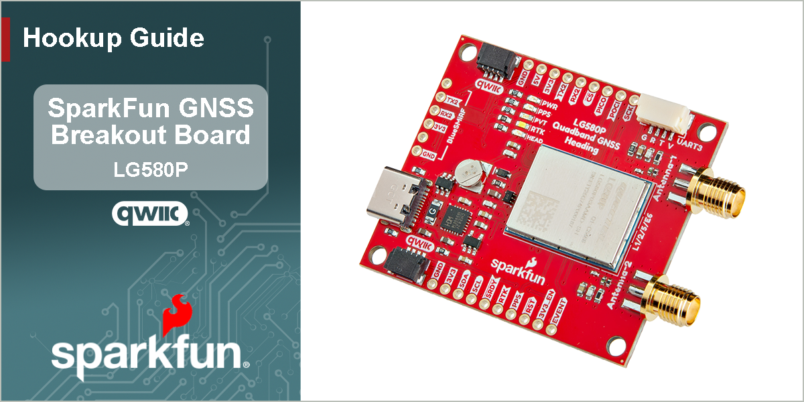

<figure markdown>

</figure>

---

# Introduction

-   <a href="https://www.sparkfun.com/sparkfun-quadband-gnss-rtk-with-heading-breakout-lg580p-qwiic.html">
	**SparkFun Quadband GNSS RTK with Heading Breakout - LG580P (Qwiic)** 
	**SKU:** GPS-28019

	---

	<figure markdown>
	
	</figure></a>

	<article style="text-align: center;" markdown>
	{ .tinyqr } [Purchase from SparkFun :fontawesome-solid-cart-plus:{ .heart }](https://www.sparkfun.com/sparkfun-quadband-gnss-rtk-with-heading-breakout-lg580p-qwiic.html){ .md-button .md-button--primary }
	</article>

-	The [SparkFun Quadband GNSS RTK with Heading Breakout - LG580P (Qwiic)](https://www.sparkfun.com/sparkfun-quadband-gnss-rtk-with-heading-breakout-lg580p-qwiic.html) features the Quectel LG580P GNSS module, providing exceptional positioning and heading accuracy. The LG580P GNSS module is an upgraded version of the LG290P on our [SparkFun Quadband GNSS RTK Breakout - LG290P (Qwiic)](https://www.sparkfun.com/sparkfun-quadband-gnss-rtk-breakout-lg290p-qwiic.html); providing an additional GNSS antenna input for instantaneous heading determination down to 0.1&deg;. In traditional navigation systems, such as those used on your phone or car, previous navigation points are utilized to determine the course heading. This is the reason why the arrow indicator will spin or be oriented in the wrong directions when the navigation system first boots or has been stationary for extended periods of time. However, with the LG580 GNSS module, users are provided with a dedicated heading without relying on previous course data points, magnetometers/compasses, or gyroscopes in IMUs, which can introduce small errors.

	The board's dimensions, pin layout, and connectors are similar to our very popular [SparkFun GPS-RTK-SMA Breakout - ZED-F9P (Qwiic)](https://www.sparkfun.com/sparkfun-gps-rtk-sma-breakout-zed-f9p-qwiic.html), featuring a compact design and convenient Qwiic connectors. *(\*Depending on your application, this board could potentially function as a drop-in replacement; users should verify the pin compatibility of this board with their current installation.)* The board also accommodates users with a diverse choice of interfaces including UART, SPI*, I^2^C*, and CAN*. The board has three UART ports, which are accessible through the USB-C connector, BlueSMiRF *(6-pin PTH)* header, and 4-pin locking JST connector. Users can also interface with the board through the 25 PTH pins that are broken out around the edge of the board. For the GNSS antenna(s), SMA antenna connectors are provided on the edge of the board; an optional, secondary antenna can be utilized for heading determination. We also provide two 4-pin JST Qwiic connectors for future use, when the I^2^C feature becomes available for the GNSS module.

	The LG580P module is a quad-band, multi-constellation, high-precision, RTK and heading GNSS receiver. The module is capable of simultaneously receiving signals from the `L1`, `L2`, `L5`, and `L6`/`E6` frequency bands of the GPS, GLONASS, Galileo, BDS, QZSS, and NavIC GNSS constellations. In addition, the module supports SBAS augmentation systems (WAAS, EGNOS, BDSBAS, MSAS, GAGAN, KASS, ASECNA, SouthPAN, and SDCM), PPP services* (BDS PPP-B2b, QZSS CLAS, MADOCA-PPP, and Galileo HAS), RTCM, and RTK corrections for precision navigation with a fast convergence time and reliable performance.

	The built-in professional-grade interference signal detection and elimination algorithms, effectively mitigate multiple narrow-band interference sources and significantly improve signal reception performance in complex electromagnetic environments. In addition, the RTK and heading algorithms ensure reliable positioning in challenging scenarios such as urban environments and deep tree cover. With its high-precision, low power consumption and a high positioning and heading update rate of up to 20 Hz, this board is ideal for high-precision navigation applications, such as intelligent robots, precision agriculture, ADAS, and autonomous driving.

!!! warning "Features Under Development"
	- **I^2^C/SPI/CAN** - Currently, only the UART interface is supported by the module.
	- **PPP Services** - Corrections for some of the PPP services have not been implemented.

??? question "Product Comparison"
	<article style="text-align: center;" markdown>

	| Characteristics | LG580P | LG290P |
	| :-------------- | :----: | :----: |
	| Supply Voltage:                   | 3.0–3.6V | 3.15–3.45V |
	| Acquisition Current:              | 98mA (323.4mW)  | 91mA (300.3mW) |
	| Tracking Current:                 | 116mA (382.8mW) | 91mA (300.3mW) |
	| Backup Mode Current:              | 18μA (59.4μmW)  | 12μA (39.6mW)  |
	| GPS Frequency bands:              | `---`    | `L1C`*     |
	| QZSS Frequency bands:             | `---`    | `L1C`*     |
	| SBAS Frequency bands:             | `L1`     | `L1 C/A`   |
	| Horizontal Accuracy (Autonomous): | 1m       | 0.7m       |
	| Vertical Accuracy (Autonomous):   | 1.5m     | 2.5m       |
	| Heading Accuracy:                 | 0.1&deg; | NA         |
	| TTFF (Hot Start):                 | 1.8s     | 1.7s       |
	| Sensitivity (Acquisition):        | -145dBm  | -146dBm    |
	| Antenna Power Supply:             | External | External or Internal |
	| UART Protocols:                   | `QGC`    | `---`      |
	| CAN Interface*:                   | x1       | NA         |
	| Footprint:                        | 21mm × 16mm × 2.7mm | 12.2mm × 16mm × 2.6mm |
	| Weight:                           | 1.4g     | ~0.9g      |

	</article>

	!!! note
		- `---`: Any remarks on the other module, are additional features
		- NA: Feature is not available for that module
		- *: Feature is still under development

In this guide we'll cover how to setup the LG580P GNSS breakout board. To follow along with this tutorial, at a minimum, users will need the following items:

- Computer with an operating system (OS) that is compatible with all the software installation requirements
- [USB 3.1 Cable A to C - 3 Foot](https://www.sparkfun.com/usb-3-1-cable-a-to-c-3-foot.html) - Used to interface with the LG580P GNSS Breakout (1)
- [SparkFun Quadband GNSS RTK with Heading Breakout - LG580P (Qwiic)](https://www.sparkfun.com/sparkfun-quadband-gnss-rtk-with-heading-breakout-lg580p-qwiic.html)
- [GNSS Multi-Band L1/L2/L5 Surveying Antenna](https://www.sparkfun.com/gnss-multi-band-l1-l2-l5-surveying-antenna-tnc-spk6618h.html)
	- [SMA Male to TNC Male Cable](https://www.sparkfun.com/reinforced-interface-cable-sma-male-to-tnc-male-10m.html)
	- [Antenna Mount](https://www.sparkfun.com/gnss-magnetic-antenna-mount-5-8-11-tpi.html)

1. If your computer doesn't have a USB-A slot, then choose an appropriate cable or adapter.

-   <a href="https://www.sparkfun.com/usb-3-1-cable-a-to-c-3-foot.html">
	<figure markdown>
	
	</figure>

	---

	**USB 3.1 Cable A to C - 3 Foot** 
	CAB-14743</a>

-   <a href="https://www.sparkfun.com/sparkfun-quadband-gnss-rtk-with-heading-breakout-lg580p-qwiic.html">
	<figure markdown>
	
	</figure>

	---

	**SparkFun Quadband GNSS RTK with Heading Breakout - LG580P (Qwiic)** 
	GPS-28019</a>

-   <a href="https://www.sparkfun.com/gnss-multi-band-l1-l2-l5-surveying-antenna-tnc-spk6618h.html">
	<figure markdown>
	
	</figure>

	---

	**GNSS Multi-Band L1/L2/L5 Surveying Antenna - TNC (SPK6618H)** 
	GPS-21801</a>

-   <a href="https://www.sparkfun.com/reinforced-interface-cable-sma-male-to-tnc-male-10m.html">
	<figure markdown>
	
	</figure>

	---

	**Reinforced Interface Cable - SMA Male to TNC Male (10m)** 
	CAB-21740</a>

-   <a href="https://www.sparkfun.com/gnss-magnetic-antenna-mount-5-8-11-tpi.html">
	<figure markdown>
	
	</figure>

	---

	**GNSS Magnetic Antenna Mount - 5/8" 11-TPI** 
	PRT-21257</a>

## Section Topics
This guide is divided into multiple sections:

- The **Hardware** section has two sub-sections that provide:
	- An overview of the board's design, major components, and interfaces. Refer to this page for information on the connectors, breakout pins, and jumpers.
	- Assembly instructions for this product's interfaces.
- The **Software** section has several sub-sections. The LG580P module has numerous capabilities and a multitude of ways to configure and interface with them.
- In the **Resources** and **Support** sections, users can find the design files (KiCad files & schematic), relevant documentation (datasheets, white papers, etc.) and other helpful links on the Resources page. Lastly, the **Troubleshooting Tips** page includes helpful tips and instructions for how to receive technical support from SparkFun.
